# WetCat: Enabling Automated Skill Assessment in Wet-Lab Cataract Surgery Videos

Dataset release for **"WetCat: Enabling Automated Skill Assessment in Wet-Lab Cataract Surgery Videos"** accepted at ACM MM 2025.

## Overview

The **WetCat** dataset is the first publicly available dataset of wet-lab cataract surgery videos specifically curated for automated skill assessment. WetCat comprises **60 high-resolution recordings** of cataract procedures performed by trainee ophthalmologists on artificial eyes (OKULO-ONE DIMS model) using the **Haag-Streit OSTC microscope system** during 2024-2025. 

Unlike existing datasets derived from real patient surgeries, WetCat provides a controlled training environment that enables the development of interpretable, AI-driven evaluation tools aligned with established clinical skill metrics such as GRASIS and OSCAR. The dataset focuses on the critical phases of **capsulorhexis** and **phacoemulsification**, which are essential to cataract surgery training.

Each video captures the complete surgical workflow with an average duration of **794 seconds** (standard deviation: 509 seconds), recorded at **1920×1080 resolution** and **30 fps**.


*Figure 1: Hands-on cataract surgery training in the wet lab.*

---

## Dataset Components

### 1. Phase Annotations

All 60 videos are comprehensively annotated with frame-level surgical phase labels, segmented into four distinct phases:

- **Capsulorhexis (Rhexis)**: The precision-critical step of creating a circular opening in the anterior capsule
- **Phacoemulsification (Phaco.)**: The lens fragmentation and removal phase
- **Idle**: Transition periods between phases when instruments are being changed
- **Rest**: Other surgical phases


<div align="center">
<table>
<tr>
<td align="center">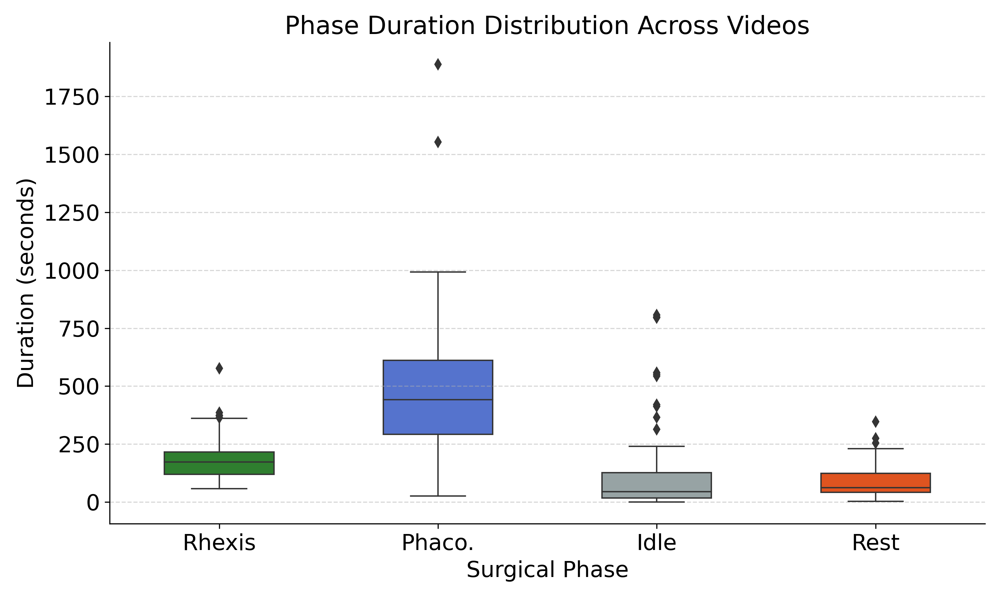</td>
<td align="center">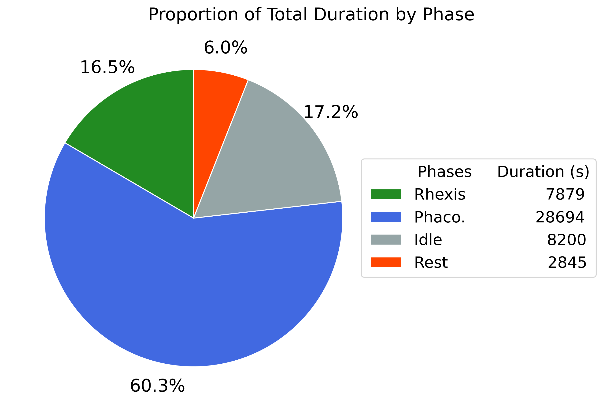</td>
</tr>
</table>
</div>

*Figure 2: Distribution of surgical phase durations across videos (left) and overall phase proportions in the dataset (right).*

<div align="center">
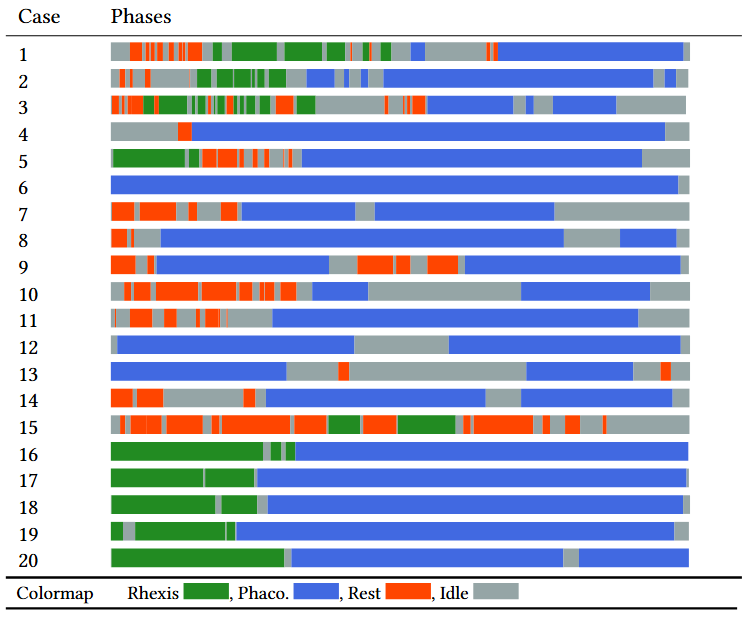
</div>

*Figure 3: Visualization of relevant phase annotations for representative wet-lab videos from the dataset.*

---

### 2. Semantic Segmentation Annotations

The dataset includes dense **pixel-level semantic segmentations** for **1,469 selected frames**, encompassing key anatomical structures and surgical instruments critical for skill assessment:


<div align="center">
<table>
<tr>
<td align="center">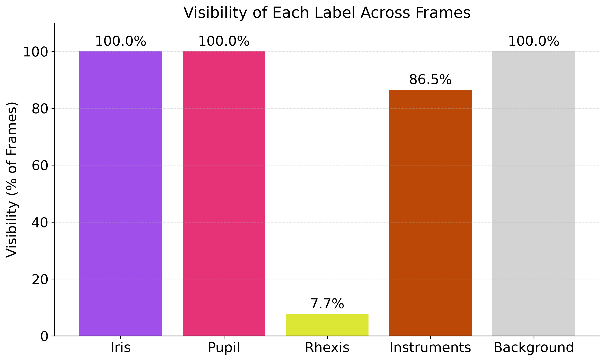</td>
<td align="center">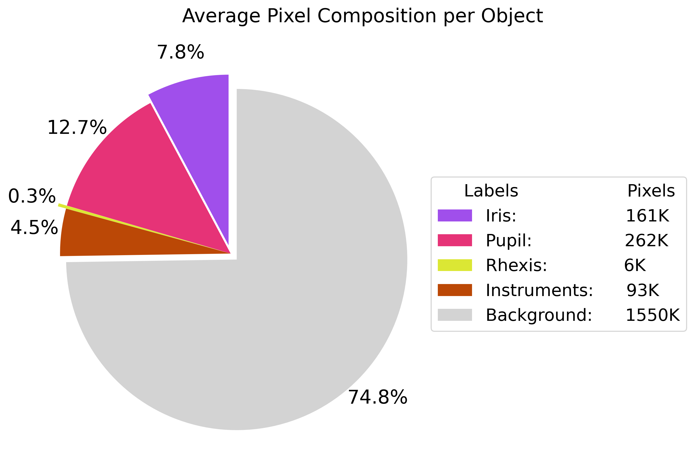</td>
</tr>
</table>
</div>

*Figure 4: Comparison of segmentation label visibility (left) and pixel distribution across videos (right).*

<div align="center">
<table>
<tr>
<td align="center"><b>Beginning of Capsulorhexis</b><br></td>
<td align="center"><b>End of Capsulorhexis</b><br></td>
</tr>
<tr>
<td align="center"><b>Beginning of Phacoemulsification</b><br></td>
<td align="center"><b>End of Phacoemulsification</b><br></td>
</tr>
</table>
</div>

*Figure 5: Sample frames from relevant phases in a wet-lab cataract surgery with corresponding semantic segmentation annotations.*

---

## Skill Assessment Framework

WetCat enables objective, automated skill assessment aligned with established clinical frameworks (GRASIS, OSCAR). The annotations support evaluation of the following metrics:

<div align="center">
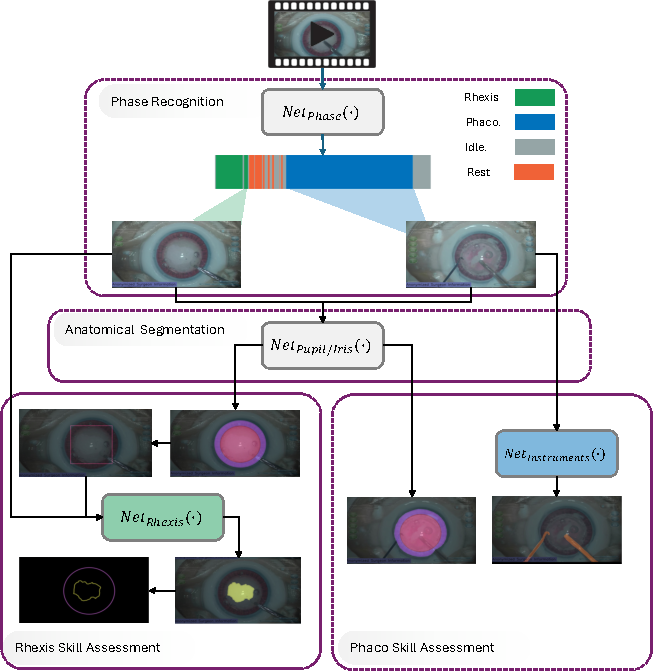
</div>

*Figure 6: Overall framework for skill assessment in wet-lab cataract surgery using phase recognition and semantic segmentation.*

### Capsulorhexis Assessment Metrics

- **Roundness**: Measured by circularity ratio (area vs. perimeter squared)
- **Centration**: Euclidean distance between capsulorhexis and limbus centers, normalized by limbus radius
- **Diameter**: Compared against clinically ideal range of 4.5–5.5 mm
- **Smoothness**: Edge continuity evaluated using curvature-based or Fourier descriptors
- **Precision Benchmarking**: Dice Score and Jaccard Index comparison with ideal reference regions

### Phacoemulsification Assessment Metrics

- **Eye Stability**: Limbus center tracking throughout the phase, with deviations within ±10% considered acceptable
- **Phacoemulsification Duration**: Total time compared against clinical benchmarks
- **Non-Dominant Hand Instrument Analysis**: Movement frequency, amplitude, and trajectory regularity assessment

---

## Anatomical Calibration

For scale normalization and anatomical measurements, the dataset uses specifications from the **OKULO-ONE DIMS artificial eye model**:

- **Limbus diameter**: 11.9 mm
- **Pupil diameter**: 8.5 mm
- **Lens diameter**: 10 mm
- **Anterior chamber depth (ACD)**: 3.75 mm
- **Lens thickness**: ~3.87 mm (under standard intraocular pressure)

---

## Comparison with Existing Datasets

| Attribute | CaDIS | CatRel | Cataract-1K | **WetCat** |
|-----------|-------|---------|-------------|------------|
| **Year** | 2015 | 2017-2018 | 2021-2023 | **2024-2025** |
| **Environment** | Real Surgery | Real Surgery | Real Surgery | **Wet-Lab** |
| **Phase Annotations** | ✗ | 22 videos (5 phases) | 56 videos (13 phases) | **60 videos (4 phases)** |
| **Semantic Segmentation** | 4,670 frames | ✗ | 2,256 frames | **1,469 frames** |
| **Anatomy Segmentation** | ✓ | N/A | ✓ | **✓** |
| **Instrument Segmentation** | ✓ | N/A | ✓ | **✓** |
| **Rhexis Segmentation** | ✗ | N/A | ✗ | **✓** |
| **Resolution** | 960×540 | 224×224 | 1024×768 | **1920×1080** |
| **Frame Rate** | N/A | 25 fps | 30 fps | **30 fps** |
| **Skill Assessment Focus** | ✗ | ✗ | ✗ | **✓** |

---

## Technical Validation

We provide comprehensive benchmarking results in the paper:

### Phase Recognition Performance
Multiple architectures evaluated including CNN-RNN (VGG-LSTM, VGG-BiLSTM), Vision Transformers, and 3D ResNets, achieving up to **85.51% F1-Score** with VGG-BiLSTM.

<div align="center">
<table>
<tr>
<td align="center"><b>ResNet3D</b><br>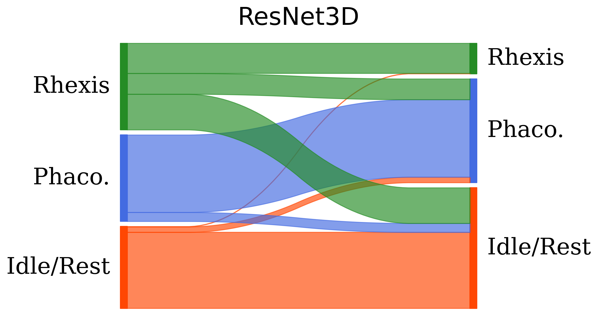</td>
<td align="center"><b>VGG-LSTM</b><br>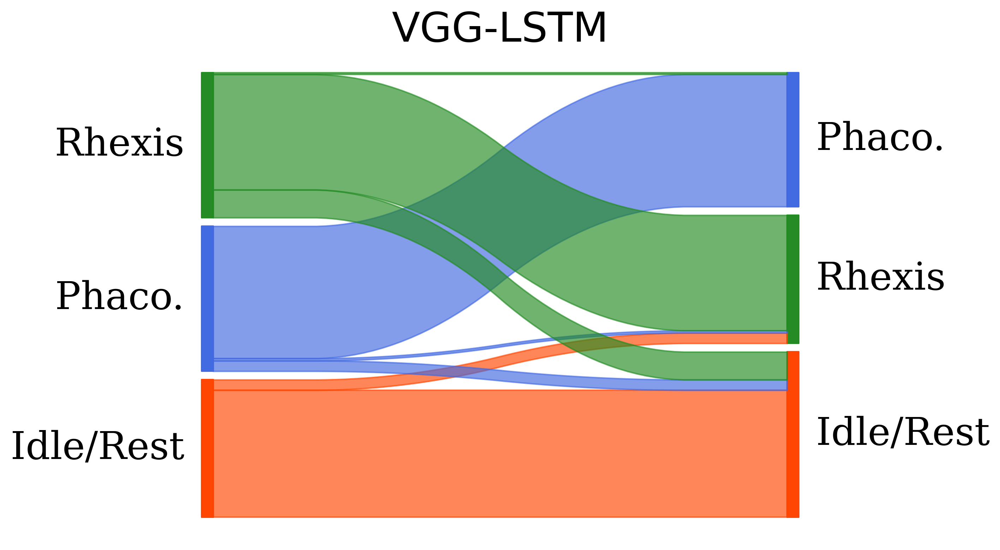</td>
<td align="center"><b>VGG-GRU</b><br>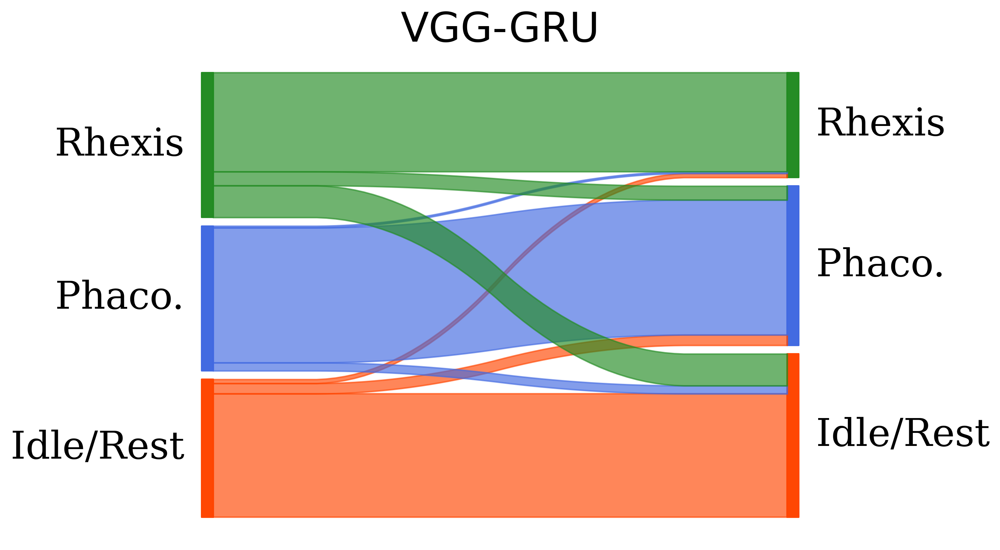</td>
</tr>
<tr>
<td align="center"><b>VGG-BiLSTM</b><br>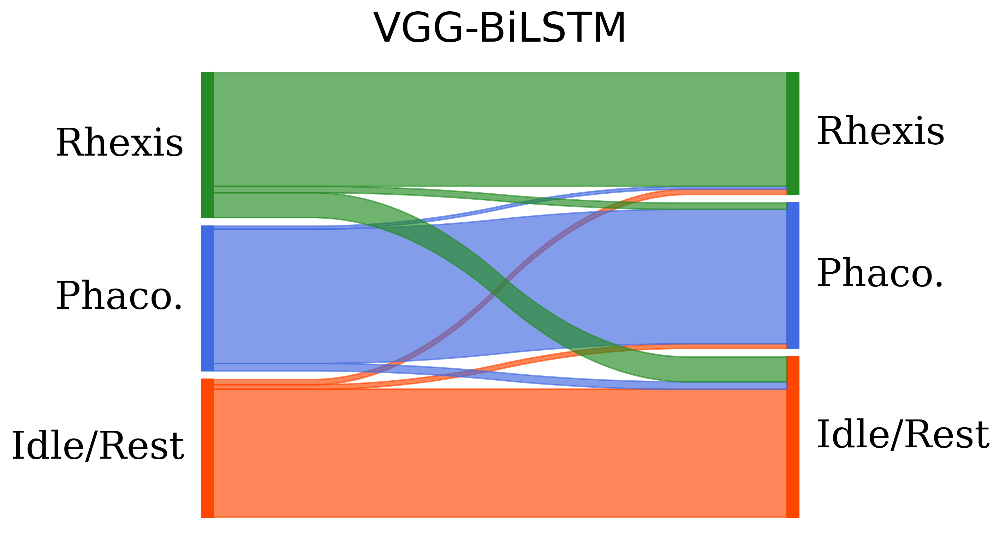</td>
<td align="center"><b>VGG-BiGRU</b><br>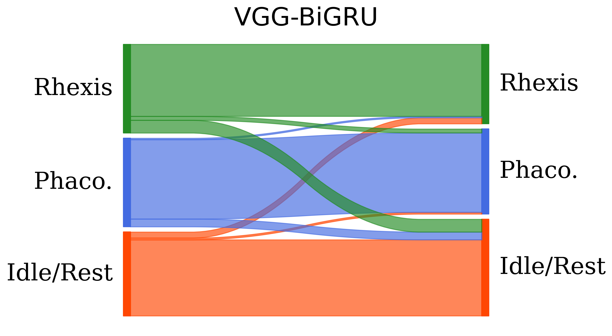</td>
<td align="center"><b>VGG-Transformer</b><br>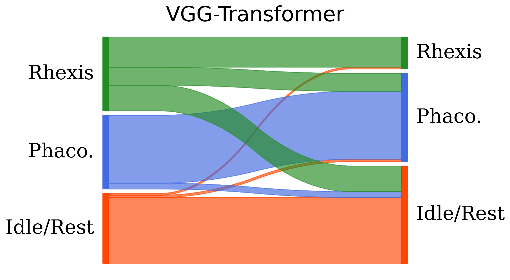</td>
</tr>
</table>
</div>

*Figure 7: Sankey diagrams of confusion matrices corresponding to different phase recognition networks.*

### Semantic Segmentation Performance
State-of-the-art methods benchmarked including UNet++, DeepLabV3+, UPerNet, and SAM with LoRA fine-tuning, achieving:
- **Anatomy**: Up to 91.59% Dice (SAM-LoRA)
- **Instruments**: Up to 80.62% Dice (SAM-LoRA)
- **Rhexis**: Up to 85.79% Dice (SAM-LoRA with bounding box prompts)

All experimental details, training settings, and cross-validation protocols are provided in Section 4 of the paper.

---

## Citation

A reference must be made to the following publication when this dataset is used in any academic and research reports:

Negin Ghamsarian, Raphael Sznitman, Klaus Schoeffmann, and Jens Kowal. 2025. WetCat: Enabling Automated Skill Assessment in Wet-Lab Cataract Surgery Videos. In Proceedings of the 33rd ACM International Conference on Multimedia (MM '25), October 27–31, 2025, Dublin, Ireland. ACM, New York, NY, USA, 7 pages. https://doi.org/10.1145/3746027.3758274

**BibTeX:**
```bibtex
@inproceedings{WetCat2025,
  author = {Negin Ghamsarian and 
            Raphael Sznitman and 
            Klaus Schoeffmann and 
            Jens Kowal},
  title = {WetCat: Enabling Automated Skill Assessment in Wet-Lab Cataract Surgery Videos},
  booktitle = {Proceedings of the 33rd ACM International Conference on Multimedia},
  series = {MM '25},
  year = {2025},
  location = {Dublin, Ireland},
  pages = {1--7},
  publisher = {ACM},
  address = {New York, NY, USA},
  doi = {10.1145/3746027.3758274}
}
```

---

## License

The dataset is licensed under **Creative Commons Attribution-NonCommercial-ShareAlike 4.0 International (CC BY-NC-SA 4.0)**.

This license allows users of this dataset to:
- **Share**: Copy and redistribute the material in any medium or format
- **Adapt**: Remix, transform, and build upon the material

Under the following terms:
- **Attribution**: You must give appropriate credit, provide a link to the license, and indicate if changes were made
- **NonCommercial**: You may not use the material for commercial purposes
- **ShareAlike**: If you remix, transform, or build upon the material, you must distribute your contributions under the same license

For further legal details, please read the complete [license terms](https://creativecommons.org/licenses/by-nc-sa/4.0/legalcode).

---

## Download

If you agree to the above license conditions, you can download the dataset:

- **[Complete WetCat Dataset](https://www.synapse.org/Synapse:syn66401174/files/)** - Full dataset with all annotations
- **[Dataset Codes](https://github.com/Negin-Ghamsarian/WetCat)** - Python codes for training 

The dataset is hosted on **Synapse** and requires registration to access.

---

## Acknowledgments

This work was funded by **HaagStreit AG**. We would like to thank Finia Kowal, Alessia Bruzzo, and Ylenia Di Maro for their invaluable contributions to the meticulous annotation of the dataset.

---

## Contact

For questions, issues, or collaboration inquiries, please contact:

- **Negin Ghamsarian**: negin.ghamsarian@unibe.ch

---

## Related Publications

For more information about our work on surgical video analysis and cataract surgery datasets, please see:

Ghamsarian et al. "Cataract-1K: Cataract Surgery Dataset for Scene Segmentation, Phase Recognition, and Irregularity Detection" - Scientific Data, 2024

